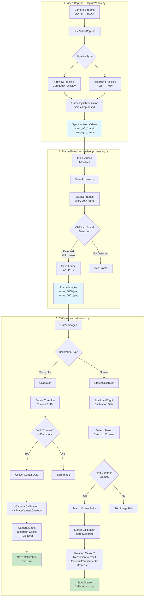

# Camera Calibration System - Data Flow

## Component Details

### 1. CaptureVideo.py - DualVideoCapture Class
**Purpose**: Capture synchronized video streams from multiple cameras

**Key Features**:
- Receives H.264 video via UDP/RTP from multiple camera ports
- Uses GStreamer pipelines for video processing
- Two-phase approach: preview pipeline (countdown) → recording pipeline (actual recording)
- Frame synchronization using timestamps with 33ms tolerance
- Outputs timestamped MP4 files for each camera

**Data Flow**:
- Input: UDP RTP streams (H.264) from cameras
- Output: Synchronized MP4 video files (`cam_name_timestamp.mp4`)

---

### 2. video_processing.py - VideoProcessor Class
**Purpose**: Extract calibration frames from recorded videos

**Key Features**:
- Processes MP4 videos frame-by-frame
- Detects ChArUco board presence in each frame
- Extracts frames at regular intervals (every 30th frame / 1 second at 30fps)
- Only saves frames where ChArUco board is detected with ≥15 corners
- Clears output directory before extraction

**Data Flow**:
- Input: MP4 video files
- Output: JPEG images containing ChArUco boards (`frame_XXXX.jpeg`)

---

### 3. calibration.py - Calibrator & StereoCalibrator Classes
**Purpose**: Perform camera calibration using extracted frames

#### Calibrator (Monocular Calibration)
**Key Features**:
- Detects ChArUco markers in images
- Interpolates ChArUco corners from detected markers
- Requires ≥30 corners per image for valid calibration data
- Uses `aruco.calibrateCameraCharuco()` for camera calibration
- Outputs camera matrix, distortion coefficients, and RMS error

**Data Flow**:
- Input: Directory of JPEG images with ChArUco boards
- Output: NPZ file with camera calibration data (mtx, dist, rvecs, tvecs, rms_error)

#### StereoCalibrator (Stereo Calibration)
**Key Features**:
- Loads pre-calibrated left and right camera data
- Detects ChArUco corners in synchronized image pairs
- Matches common corner IDs between left/right images (requires ≥10 common IDs)
- Uses `cv.stereoCalibrate()` with fixed intrinsics
- Outputs rotation (R), translation (T), essential (E), and fundamental (F) matrices

**Data Flow**:
- Input: Left/right camera calibration data + stereo image pairs
- Output: NPZ file with stereo calibration data (R, T, E, F, stereo_error)

---

## Typical Workflow

1. **Record Videos**: Use CaptureVideo.py to capture synchronized videos from stereo camera setup
2. **Extract Frames**: Run video_processing.py to extract frames containing ChArUco boards
3. **Monocular Calibration**: Use Calibrator to calibrate each camera individually
4. **Stereo Calibration**: Use StereoCalibrator to compute stereo relationship between cameras
